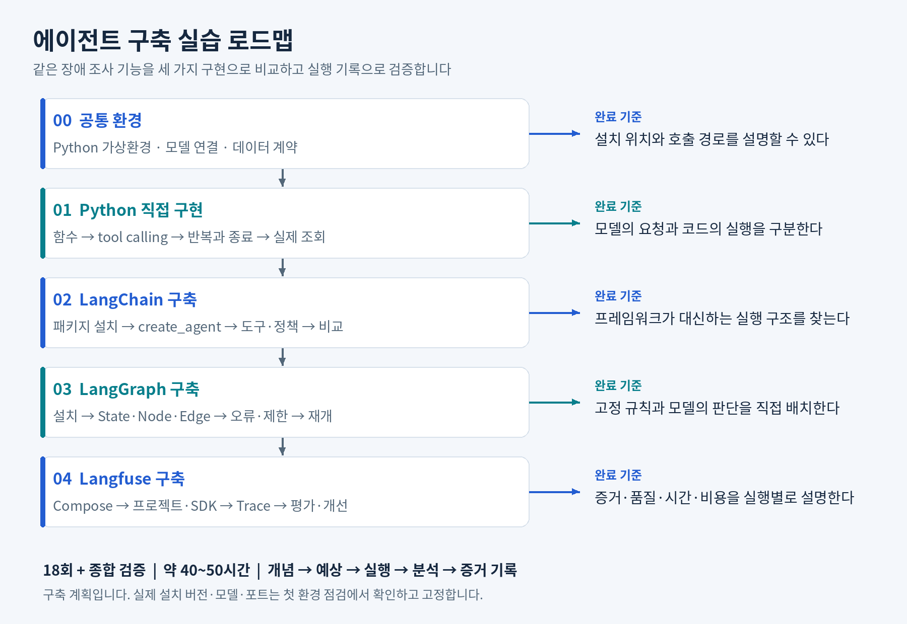

# AI Agent Lab

주문·결제 장애를 조사하는 에이전트를 **Python 직접 구현 → LangChain 구축 → LangGraph 구축 → Langfuse 관찰·평가** 순서로 학습하는 프로젝트입니다.

같은 모델·조회 도구·데이터를 재사용하면서, 모델의 판단과 프로그램의 실제 실행을 구분하고 실행 흐름·상태·오류·비용을 설명하는 것이 목표입니다. 조사는 읽기 전용이며, 최종 보고는 관측 사실·원인 후보·미확인 사항·추가 확인을 구분합니다.

모든 실습의 중심은 **왜 필요한가 → 그래서 왜 이 방법인가 → 어떻게 확인할 것인가**입니다. [학습 원칙](docs/learning-principles.md)에 따라 개념과 선택 근거를 먼저 설명하고, 예상과 실제 결과를 비교해 판단 범위를 기록합니다.

**현재 상태 (2026-10-09): Gemini와 로컬 Qwen3.5-9B로 mock 도구 호출·분기·재시도를 확인했습니다. 모델 요약에서 필수 내용이 빠지는 문제를 관측해 사실 코드 출력과 모델 설명을 분리했습니다. 사용자 PC에서 모델 없는 검증 6개와 실제 Qwen + graph/separated의 flaky·empty·timeout을 확인했습니다. 코드의 사실 출력·종료 흐름은 예상과 일치했지만 모델 설명에는 부정확한 전제가 남았습니다. 실제 관측 데이터 연결, 체크포인트, Langfuse는 아직 진행하지 않았습니다.**

## 문서

- [학습 원칙과 기록 구조](docs/learning-principles.md)
- [2026-10-07 실습 기록: 목적·설계 이유·검증 결과·오류](docs/evidence/2026-10-07-foundations.md)
- [2026-10-09 모델 HTTP 재시도와 도구 재시도 구분](docs/evidence/2026-10-09-model-retry.md)
- [2026-10-09 Ollama·로컬 Qwen 연결과 장비 관측](docs/evidence/2026-10-09-local-models.md)
- [2026-10-09 요약 지시 비교와 정보 누락·표현 문제](docs/evidence/2026-10-09-local-summary.md)
- [2026-10-09 필수 사실 코드 출력·모델 설명 분리](docs/evidence/2026-10-09-facts-and-explanation.md)
- [실습 코드와 재현 방법](examples/2026-10-07/README.md)
- [전체 커리큘럼: 18회차와 완료 기준](docs/curriculum.md)
- [구축 위치와 실행 워크플로우](docs/architecture.md)
- [진행 체크리스트](docs/progress.md)
- [실습 증거 기록 양식](docs/evidence/TEMPLATE.md)
- [15페이지 커리큘럼 PDF](docs/Agent_Engineering_Curriculum_20261003.pdf)
- [공식 참고 문서](docs/references.md)



## 학습 순서

| 단계 | 구축 대상 | 완료 시 설명할 수 있는 것 | 계획 시간 |
|---|---|---|---|
| 0 | Python 가상환경, 모델 SDK, 데이터 계약 | 실행 위치와 모델 호출 경로 | 3~4시간 |
| 1 | Python 도구와 에이전트 반복문 | 도구 선택·실행·결과 전달·종료 | 8~10시간 |
| 2 | LangChain 설치와 create_agent 기반 에이전트 | 프레임워크가 제공하는 기능과 직접 구현할 정책 | 8~10시간 |
| 3 | LangGraph 설치와 명시적 조사 그래프 | 상태·분기·제한·체크포인트·재개 | 9~11시간 |
| 4 | Langfuse 서버·SDK와 평가 | 실행 근거·품질·시간·토큰·비용 | 9~12시간 |
| 종합 | 재현 가능한 시연과 보고서 | 설계 이유·검증 범위·남은 한계 | 3시간 |

총 약 40~50시간의 계획이며 환경 문제 해결과 코드 읽기에 따라 달라집니다. 매 회차 **개념 → 코드·설정 해석 → 결과 예측 → 작은 단위 실행 → 결과 분석 → 증거 기록** 순서로 진행합니다.

실제 실습은 일부 단계를 교차해서 진행했습니다. 코드 동작만으로 해당 회차 전체나 학습자의 이해까지 완료 처리하지 않습니다. 안내 방식의 기준은 [학습 원칙](docs/learning-principles.md), 저장소 작업 지침은 [AGENTS.md](AGENTS.md)에 있습니다. 기록은 [실험 양식](docs/evidence/TEMPLATE.md)을 사용합니다.

## 시작점

[진행 기록과 다음 단계](docs/progress.md)를 먼저 확인합니다. 확인된 실행 환경은 Windows 11, Git Bash, Python 3.11.5의 `.venv`입니다. 폴더 이동만으로 가상환경이 활성화되지는 않으며 `source .venv/Scripts/activate`를 사용합니다. Docker와 실제 관측 서비스의 현재 가동 상태는 이번 실습에서 검증하지 않았습니다.

LangChain과 LangGraph는 Python 애플리케이션에 설치하는 라이브러리입니다. Langfuse는 별도 서버를 구축합니다. Gemini Developer API의 `gemini-3.1-flash-lite`와 Ollama의 로컬 `qwen3.5:9b`를 실습했습니다. 초기 예제는 대화 코드 복원본이며 사용자 PC 최신 파일의 복사본은 아닙니다. 일부 패키지 버전과 후속 실행 결과는 증거 문서에 기록했지만 전체 의존성 lock은 아직 없습니다.

현재 사용자 입구는 Git Bash에서 실행하는 Python 명령입니다. 프로그램의 질문은 order-api 조회로 고정돼 있습니다. Python이 도구 실행과 재시도·출력을 제어하고, Ollama가 Qwen 모델을 실행합니다. Qwen은 도구 요청과 설명을 생성합니다. 지금 도구는 가짜 데이터를 반환하며 실제 order-api나 Loki에 접속하지 않습니다. MCP와 자연어 입력 UI도 구성하지 않았습니다.

저장소의 현재 실행 파일은 루트가 아닌 `examples/2026-10-07/`에 있습니다. 기존 다운로드 파일을 덮어쓰지 않고 저장소 버전을 실행하려면, 설치가 완료된 환경에서 프로젝트 루트 기준으로 아래를 사용합니다.

```bash
python examples/2026-10-07/local_workflows.py --check-report
python -u examples/2026-10-07/local_workflows.py --model qwen3.5:9b --engine graph --scenario flaky --summary-style separated
```

첫 명령은 모델을 호출하지 않습니다. 두 번째는 실행 중인 Ollama와 다운로드된 Qwen이 필요합니다. 전체 준비 절차는 [예제 실행 안내](examples/2026-10-07/README.md)를 따릅니다.

## 향후 코드 배치

| 위치 | 용도 |
|---|---|
| `tools/` | 공통 조회 도구, 입력 검증, 오류 처리 |
| `fixtures/` | 고정 샘플 데이터; 평가 정답은 모델 입력과 분리 |
| `apps/python_agent.py` | 직접 작성한 에이전트 반복문 |
| `apps/langchain_agent.py` | LangChain 기반 구현 |
| `apps/langgraph_agent.py` | 명시적 상태·분기·오류·재개 그래프 |
| `infra/langfuse/` | 공식 Compose 기반 서버 설정 |
| `tests/` | 데이터 계약, 제한, 오류 경로와 평가 |
| `docs/evidence/` | 설정·버전·실행 결과·해석 |

위 코드 경로는 앞으로 만들 계획입니다. 비밀값과 로컬 실행 데이터는 커밋하지 않습니다. 외부 모델 API와 서버 운용에 따른 비용은 실제 환경과 사용량에 따라 확인합니다.
