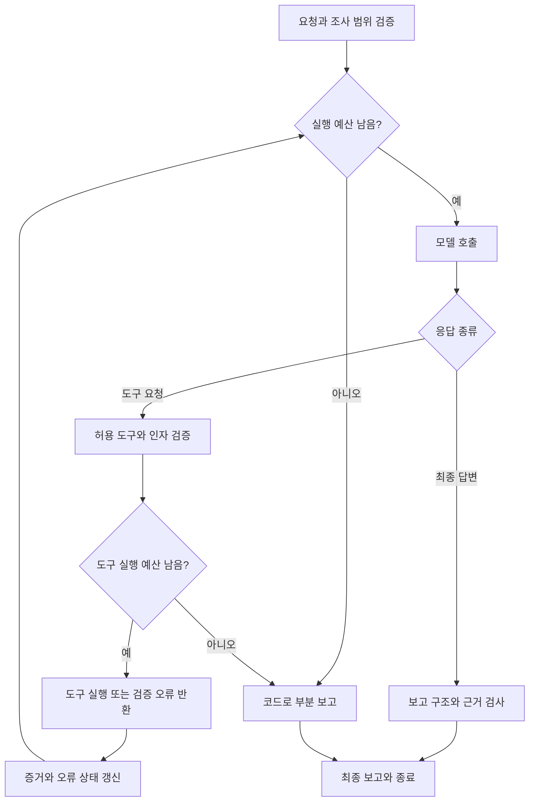
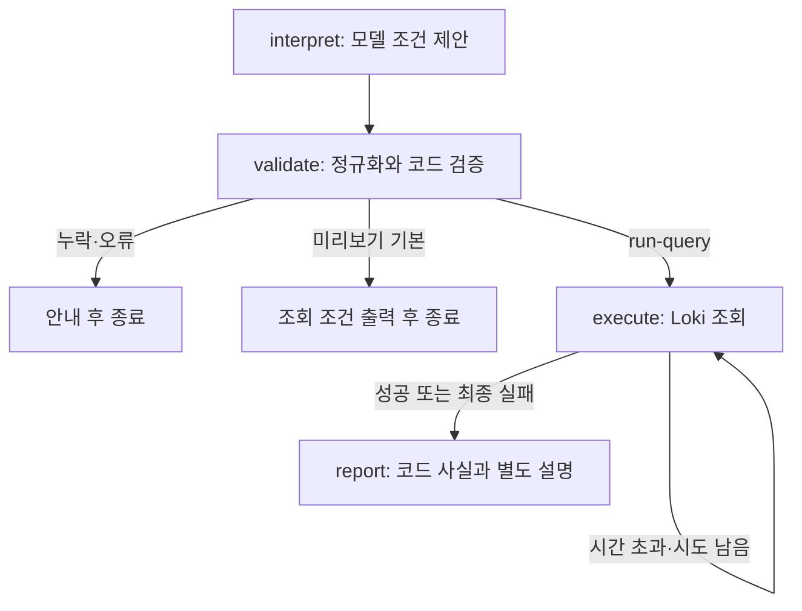

# 구축 위치와 실행 흐름

## 구축 위치

계획 환경은 Windows 11, Git Bash, Docker Desktop입니다. Python 프로그램은 우선 Windows 가상환경에서 실행하고 외부 모델 API에 연결합니다. 기존 관측 환경과 새 Langfuse 서버는 별도 Compose 프로젝트로 관리합니다. 실제 관측 환경의 실행 여부와 포트는 실습 시작 시 확인합니다.

| 연결 | 확인할 것 |
|---|---|
| Python → 모델 API | 공급자 SDK, 인증, 모델 ID, 실제 응답 |
| Python 도구 → 관측 API | 호스트에서 접근할 공개 포트, 조회 범위, timeout |
| Python 계측 → Langfuse | SDK URL, 프로젝트 키, 전송 완료 |
| 컨테이너 → 컨테이너 | 같은 Docker 네트워크의 서비스 이름 |
| 체크포인트·관측 데이터 → 저장소 | LangGraph 저장과 Langfuse 볼륨 각각의 재시작 검증 |

LangChain과 LangGraph는 애플리케이션 라이브러리입니다. 이 과정에서 별도 웹 서버를 각각 띄울 필요는 없습니다. Langfuse는 서버와 의존 서비스를 구축하고 Python에는 SDK를 설치합니다. 예시 호스트 포트 3300은 점검 후 결정할 계획값입니다.

## 실행 워크플로우

모델은 다음 행동을 요청하고 프로그램은 허용 도구·인자·예산을 검사한 뒤 실행합니다. 조회 오류와 서비스 장애는 구분합니다. 여러 도구가 요청되면 개별 실행 전에 예산을 확인합니다. 잘못된 도구 요청은 실제 실행 없이 구조화된 오류로 반환합니다.

LangGraph에서는 이 논리 구조를 State·Node·Edge로 명시합니다. 실제 노드 구성은 실습에서 결정하며 이 그림이 완성된 구현을 뜻하지는 않습니다. 모델·도구 timeout, 재시도와 오류 종료는 3-3에서 명시적으로 설계합니다.

제한을 소진하면 추가 모델 호출 없이 현재 증거·미확인 사항·종료 사유를 코드로 보고할 수 있어야 합니다. recursion_limit과 모델 API 호출 횟수는 별도입니다. 형식 검사가 보고 내용의 진실성을 보장하지 않으므로 근거를 검토합니다.

## 관측과 상태 저장

Langfuse에서 보는 것은 계측한 입력·출력·도구 호출·시간·사용량·상태 변화입니다. 모델 내부 사고 전체를 확인하는 기능으로 해석하지 않습니다. 서비스 요청의 Trace와 에이전트 조사 Trace는 별개의 실행이며 필요할 때 참조 ID로 연결합니다.

LangGraph 체크포인트는 실행을 이어가기 위한 상태이고, Langfuse 기록은 실행을 분석하기 위한 관측 데이터입니다. 메모리 체크포인터는 프로세스 종료 뒤 상태를 보존하지 못합니다. 영속 체크포인터를 붙인 뒤 실제 중단·재시작·재개와 노드 재실행을 검증합니다.

## 현재 구현된 자연어 경로 (2026-10-10)

위 종합 그림은 계획이다. 현재 `local_workflows.py --question`은 `natural_request.py`로 들어가 다음 경로를 실행한다.

모델에는 조회 실행 권한이 없는 `propose_log_query` 명세를 제공한다. 실제 함수 실행은 코드의 `query_logs` 호출이다. 숫자 문자열과 지정된 참/거짓 문자열만 정규화하고 원안을 출력한다. 허용 대상·정확한 서비스 이름·시간 범위·자료형·미해결 조건을 코드로 검사한다. 조건의 의미가 사용자 의도와 일치하는지는 형식 검사만으로 보장하지 않는다.

조건 준비 시각을 기준으로 시간 범위를 고정하고 QUERY_TIMEOUT만 최대 2회 조회한다. 조회 성공 시 코드 사실을 보존하고 모델에 설명을 요청한다. 최종 조회 실패 시 설명 호출은 생략한다. 기본 미리보기는 모델 해석 1회, 성공한 실제 조회는 해석·설명 총 2회다. 체크포인트·승인 후 재개는 아직 구현하지 않았다.

[실제 PC 관측과 검증 범위](evidence/2026-10-10-natural-request.md)를 참고한다.
